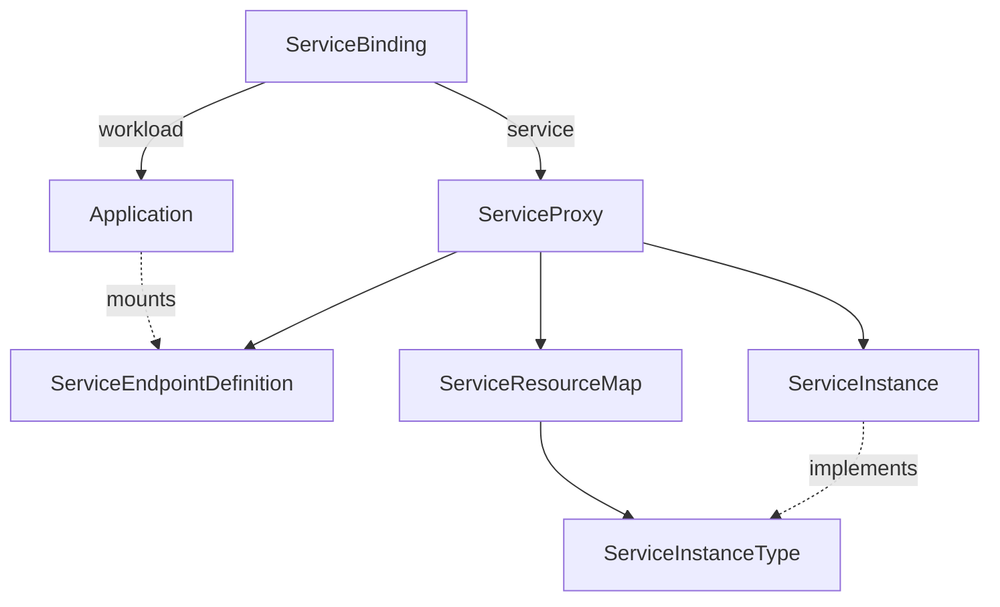
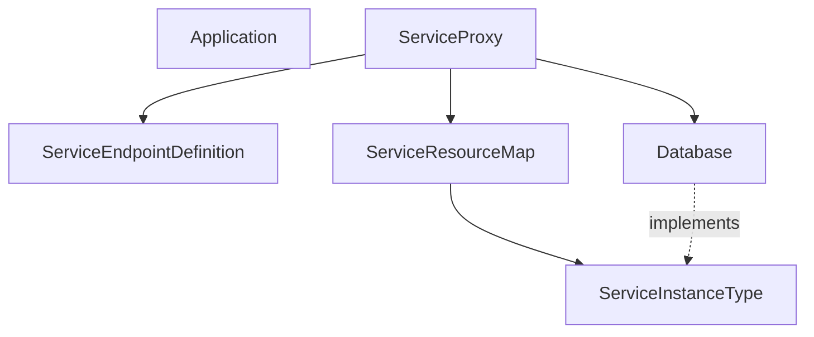
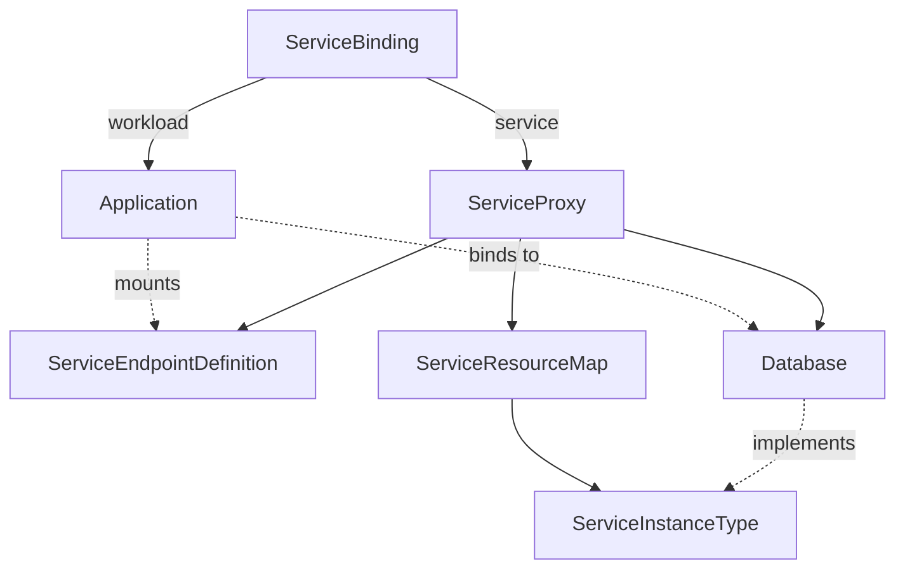

# Demo

## Feature/problem description

We investigated how to simplify the Service Binding Operator onboarding of new services.
At the time of writing, SBO can bind services that implement the Provisioned Service specification or whose resources has been properly annotated.

Provisioned Services have a field in their specification (namely `.status.binding.name`) that references to a Secret, also named Service Endpoint Definition.
In this secret, you can find the binding information, e.g., username, password, connection strings, etc.

Alternatively, you can annotate the services with a set of rules the Service Binding Operator will use to generate the Service Endpoint Definition.
It will also modify the target resource by adding the `.status.binding.name` to its specification.

These approaches rely on service Custom Resource Definitions (CRDs) changes that are usually difficult to obtain.

## Solution description <!-- Show charts or whiteboard if needed -->

We implemented the Service Mapper Operator to simplify the onboarding of new services without requiring changes to their CRDs.

The Service Mapper Operator (SMO) can generate proxies for services that are not currently bindable with the Service Binding Operator.
Proxies do implement the Provisioned Service specification and can be used by the Service Binding Operator.
Finally, the operator also generates the Service Endpoint Definition for each service.

The SMO introduces the following two Custom Resources (CR):

* **ServiceResourceMap**: defines the rules needed to generate a ServiceEndpointDefinition for a GroupVersionResource. ServiceResourceMaps are Cluster scoped.
    ```yaml
    apiVersion: binding.operators.coreos.com/v1alpha1
    kind: ServiceResourceMap
    metadata:
      annotations:
        name: srm-sample-postgresql
    spec:
      service_kind_reference:
        api_group: rds.services.k8s.aws/v1alpha1
        kind: dbinstances
      service_map:
        host: path={.status.endpoint.address}
        password: path={.spec.masterUserPassword.name},objectType=Secret,sourceKey=password
        port: path={.status.endpoint.port}
        type: path={.spec.engine}
    ```
* **ServiceProxy**: Namespaced resource that implements the ServiceBinding's specification for Provisioned Service.
    ```yaml
    apiVersion: binding.operators.coreos.com/v1alpha1
    kind: ServiceProxy
    metadata:
      name: srm-rds-psql-sample
      namespace: srm-rds-sample
    spec:
      service_instance:
        name: srm-rds-psql-sample
        namespace: srm-rds-sample
      service_resource_map: srm-sample-postgresql
    status:
      binding:
        name: srm-rds-psql-sample-sed
   ```

The SMO looks for ServiseResourceMaps and watches resources pointed by each ServiceResourceMap.

## Personas

_Administrator_ installs the service CRDS, the ServiceResourceMap, and the role/rolebinding to allow the SMO to access the services referred by the ServiceResourceMap.
_Developer_ creates a new instance of the Service and uses the Service Binding Operator to bind using the ServiceProxy instance.

## Demo

Bind the spring petclinic demo application to a PaaS Postgresql database running on Amazon (Amazon RDS).



**We have**
* Openshift cluster
	* Operators
		* AWS RDS
		* Service Binding Operator 1.3.1
		* Service Mapper Operator
* Postgresql database on Amazon RDS
* Application deployed (not binded)


**We want**
1. Bind the application to the database using the Service Binding Operator

**Demo**

1. Publish the Service Resource Map: the Service Mapper Operator will create the Service Proxy and Service Endpoint Definition.



2. Publish the Service Binding: the Service Binding Operator will mount the Service Endpoint Definition into the Application container.



