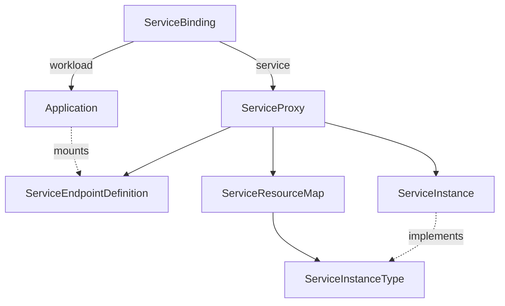

# Demo

## Feature/problem description

We investigated how simply the onboarding of new services in the list of the ones that the Service Binding Operator can easily work with.
At now, SBO can bind services that implements the Provisioned Service specification or by annotating resources.

Provisioned Services have a field in their specification (namely `.status.binding.name`) that references to a Secret, also named Service Endpoint Definition.
In this secret you can find the information needed to bind to the service, e.g. username, password, connection strings, etc.

Alternatively, you can annotate the services with a set of rules the ServiceBindingOperator will use to automatically generate the Service Endpoint Definition.
It will also modify the target resource by adding the `.status.binding.name` to its specification.

These approaches relies on service Custom Resource Definitions (CRDs) changes, that are difficult to obtain.

## Solution description <!-- Show charts or whiteboard if needed -->

To simplify the onboarding of new services without requiring changes to their CRDs, we implemented the Service Mapper Operator.

The Service Mapper Operator (SMO) can generate proxies for services that are not currently bindable with the Service Binding Operator.
Proxies do implement the Provisioned Service specification and can be used by the Service Binding Operator.
Finally, the operator also takes care of generating the Service Endpoint Definition for each Service.

The SMO introduces the following two Custom Resources (CR):

* **ServiceResourceMap**: defines the rules needed to generate a ServiceEndpointDefinition for a GroupVersionResource. ServiceResourceMaps are Cluster scoped.
    ```yaml
    apiVersion: binding.operators.coreos.com/v1alpha1
    kind: ServiceResourceMap
    metadata:
      annotations:
        name: srm-sample-postgresql
    spec:
      service_kind_reference:
        api_group: rds.services.k8s.aws/v1alpha1
        kind: dbinstances
      service_map:
        host: path={.status.endpoint.address}
        password: path={.spec.masterUserPassword.name},objectType=Secret,sourceKey=password
        port: path={.status.endpoint.port}
        type: path={.spec.engine}
    ```
* **ServiceProxy**: Namespaced resource that implements the ServiceBinding's specification for Provisioned Service.
    ```yaml
    apiVersion: binding.operators.coreos.com/v1alpha1
    kind: ServiceProxy
    metadata:
      name: srm-rds-psql-sample
      namespace: srm-rds-sample
    spec:
      service_instance:
        name: srm-rds-psql-sample
        namespace: srm-rds-sample
      service_resource_map: srm-sample-postgresql
    status:
      binding:
        name: srm-rds-psql-sample-sed
   ```

The SMO looks for ServiseResourceMaps and watches resources pointed by each ServiceResourceMap.

## Personas

_Administrator_ installs the ServiceResourceMap into the cluster and the role/rolebinding to allow the SMO to access the services referred by the ServiceResourceMap.
_Developer_ creates a new instance of the Service and uses the Service Binding Operator to bind using the ServiceProxy instance.

## Demo

Bind the spring petclinic demo application to a PaaS Postgresql database running on Amazon (Amazon RDS).



